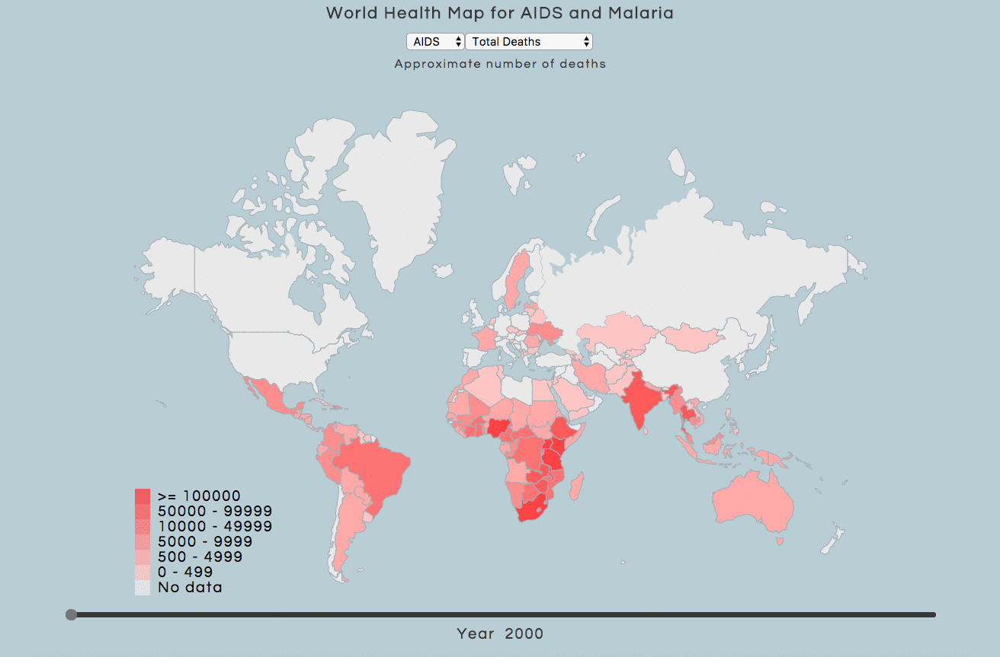

# World Health Map (AIDS and Malaria)

[LIVE](https://ckim2013.github.io/health_map/)

## Demo

## Background and Overview
Before I started programming, I was a biologist who researched diseases in hopes of one day, improving the lives of people around the world.

To pay tribute to my roots and to those affected by AIDS/Malaria, I implemented a 2D world map that displays the statistics of AIDS and Malaria around the world.

## Technologies employed
- Javascript
- D3.js
- Webpack
- HTML/CSS

## Features
When users come into the site, they are met with a modal that explains the background of the project and the sources of data. They are then able to see a choropleth (heat map) of the world based on a certain statistic on a particular disease. The users are able to toggle between different diseases and then toggle certain statistics about these diseases. The choropleth will change colors based on what the user inputs.

## Future Directions
I want to possibly implement an AJAX which will call an API that will give back statistics on any disease possible. I would also like to try to display different statistics as well. Lastly, I want to change the map into a 3D globe to make the visuals more appealing.
