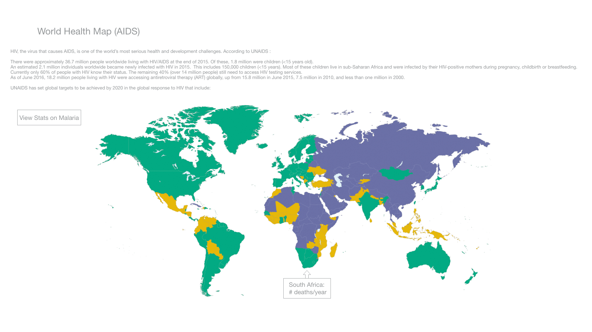

# World Health Map (AIDS and Malaria)

## Background and Overview
Before I started programming, I was a biologist who researched diseases in hopes of one day, improving the lives of people around the world healthier.

To pay tribute to my roots and to those affected by AIDS/Malaria, I want to implement a world map of some sort that displays the statistics of AIDS/Malaria (or another condition) around the world. This map would be a 2d (or 3d) rendition of the world where the user can navigate and see a certain statistic of a certain country.

## Functionality & MVP
In this World Health Map, the user is able to:
- [ ] View the world map which is divided up with clear boundaries distinguishing the different countries.
- [ ] Easily interpret which countries are the most affected via the usage of a color gradient and legend.
- [ ] Click or hover a country to get detailed numbers on health statistics.
- [ ] Be able to toggle between AIDS and Malaria to see the statistics of both.

## Wireframes
The app will be a single screen that contains a world map and a legend with a few buttons that toggles between AIDS and Malaria statistics.

Users will be able to hover over different countries on the world map in which a pop up will appear with health statistics for that particular country.  

## Architecture and Technologies
This app will be implemented with the following technologies:
- Vanilla Javascript
- D3 javascript library which manipulates DOM and applies transformations to the document. For this app's purpose, D3 will be used to render a global map.
- GeoJSON/TopoJSON which is used to encode typology to be used for the map.
- Webpack to bundle scripts to be used in the app.

There will json and csv files that hold the data for the countries.

## Implementation Timeline
Over the weekend:
- Research d3, specifically on how to render a map and attach events to each part of the map.
- Go through some d3 tutorials to get a better sense of how to use the library.

Day1: Setup all the node modules and get webpack to bundle. Install the necessary packages for the app.
- [ ] Get webpack to successfully bundle to be used in the index.
- [ ] Learn more about d3 mapping and json/csv files and how they are used for mapping out data.
- [ ] Render a global map onto the index page.

Day2: Make sure that the global map is working on the index page. Then figure out how to attach data to each country.
- [ ] Render the global map if it has not been done yet.
- [ ] Figure out a way to attach data to each country.
- [ ] Add styling so that on hover, a country will be highlighted.
- [ ] Make the country colored using the choropleth method.

Day3: Make sure that choropleth is working and start using data for another disease.
- [ ] Make a choropleth if it has not been completed yet.
- [ ] Make a country clickable which will bring up a modal of some sort that displays information for the clicked country.
- [ ] Figure out a way to also utilize data for another disease.

Day4: Create buttons that the user can click to toggle between diseases.
- [ ] Create buttons that when clicked, will toggle between the two different choropleths.
- [ ] Add necessary styling and informational paragraphs on the two diseases.

## Bonus Features
This project could become way more appealing:
- [ ] Implement a way to turn the 2d map into a 3d globe.
- [ ] Add more statistics on diseases and even try to make it so that a user can type a disease and see the world map tailored to the user's search.
